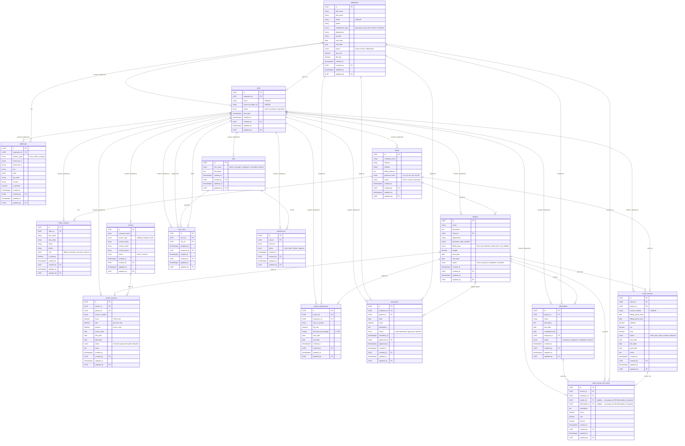

# QualAppsOps — Entity Relationship Diagram

```mermaid
erDiagram

    %% ─────────────────────────────────────────
    %% EMPLOYEE CLUSTER
    %% ─────────────────────────────────────────

    employees {
        UUID        id              PK
        string      first_name
        string      last_name
        string      email           "UNIQUE"
        string      phone
        enum        employment_type "permanent | part_time | intern | consultant"
        string      department
        string      job_title
        date        start_date
        date        end_date
        enum        status          "active | bench | offboarded"
        decimal     pay_rate
        decimal     bill_rate
        timestamptz created_at
        UUID        created_by      FK
        timestamptz updated_at
        UUID        updated_by      FK
    }

    addresses {
        UUID        id              PK
        UUID        employee_id     FK
        enum        address_type    "home | office | mailing"
        string      street_line_1
        string      street_line_2
        string      city
        string      state
        string      zip_code
        string      country
        boolean     is_primary
        timestamptz created_at
        UUID        created_by      FK
        timestamptz updated_at
        UUID        updated_by      FK
    }

    employees ||--o{ addresses          : "has"

    %% ─────────────────────────────────────────
    %% CLIENT CLUSTER
    %% ─────────────────────────────────────────

    clients {
        UUID        id              PK
        string      company_name
        string      industry
        string      website
        text        billing_address
        enum        payment_terms   "net_30 | net_45 | net_60"
        enum        status          "active | inactive | prospect"
        timestamptz created_at
        UUID        created_by      FK
        timestamptz updated_at
        UUID        updated_by      FK
    }

    client_contacts {
        UUID        id              PK
        UUID        client_id       FK
        string      first_name
        string      last_name
        string      email
        string      phone
        enum        role            "billing | technical | executive_sponsor"
        boolean     is_primary
        timestamptz created_at
        UUID        created_by      FK
        timestamptz updated_at
        UUID        updated_by      FK
    }

    clients ||--o{ client_contacts      : "has"

    %% ─────────────────────────────────────────
    %% VENDOR CLUSTER
    %% ─────────────────────────────────────────

    vendors {
        UUID        id              PK
        string      company_name
        enum        vendor_type     "staffing | software | both"
        string      contact_name
        string      contact_email
        string      contact_phone
        enum        status          "active | inactive"
        timestamptz created_at
        UUID        created_by      FK
        timestamptz updated_at
        UUID        updated_by      FK
    }

    vendor_invoices {
        UUID        id              PK
        UUID        vendor_id       FK
        UUID        project_id      FK
        string      invoice_number
        decimal     hours           "T&M hours"
        decimal     rate            "per hour rate"
        decimal     amount          "hours x rate"
        date        invoice_date
        date        due_date
        date        paid_date
        enum        status          "received | approved | paid | disputed"
        text        notes
        timestamptz created_at
        UUID        created_by      FK
        timestamptz updated_at
        UUID        updated_by      FK
    }

    vendors ||--o{ vendor_invoices      : "bills via"
    projects ||--o{ vendor_invoices     : "linked to"

    %% ─────────────────────────────────────────
    %% PROJECT CLUSTER
    %% ─────────────────────────────────────────

    projects {
        UUID        id                      PK
        string      name
        text        description
        UUID        client_id               FK
        string      department
        string      purchase_order_number
        enum        billing_type            "time_and_materials | fixed_price | non_billable"
        decimal     budget
        date        start_date
        date        end_date
        enum        status                  "active | paused | completed | cancelled"
        timestamptz created_at
        UUID        created_by              FK
        timestamptz updated_at
        UUID        updated_by              FK
    }

    project_assignments {
        UUID        id                      PK
        UUID        project_id              FK
        UUID        employee_id             FK
        string      role_on_project
        decimal     bill_rate
        integer     allocation_percentage   "0–100"
        date        start_date
        date        end_date
        timestamptz created_at
        UUID        created_by              FK
        timestamptz updated_at
        UUID        updated_by              FK
    }

    timesheets {
        UUID        id              PK
        UUID        employee_id     FK
        UUID        project_id      FK
        date        date
        decimal     hours
        text        description
        enum        status          "draft | submitted | approved | rejected"
        timestamptz submitted_at
        UUID        approved_by     FK
        timestamptz approved_at
        timestamptz created_at
        UUID        created_by      FK
        timestamptz updated_at
        UUID        updated_by      FK
    }

    deliverables {
        UUID        id              PK
        UUID        project_id      FK
        string      name
        text        description
        date        due_date
        date        completed_date
        UUID        assigned_to     FK
        enum        status          "pending | in_progress | completed | overdue"
        timestamptz created_at
        UUID        created_by      FK
        timestamptz updated_at
        UUID        updated_by      FK
    }

    clients          ||--o{ projects            : "sponsors"
    projects         ||--o{ project_assignments  : "staffed via"
    employees        ||--o{ project_assignments  : "assigned to"
    projects         ||--o{ timesheets           : "logged against"
    employees        ||--o{ timesheets           : "logged by"
    employees        ||--o| timesheets           : "approves"
    projects         ||--o{ deliverables         : "contains"
    employees        ||--o{ deliverables         : "assigned to"

    %% ─────────────────────────────────────────
    %% BILLING CLUSTER
    %% ─────────────────────────────────────────

    client_invoices {
        UUID        id                      PK
        UUID        client_id               FK
        UUID        project_id              FK
        string      invoice_number          "UNIQUE"
        date        billing_period_start
        date        billing_period_end
        decimal     subtotal
        decimal     tax
        decimal     total
        enum        status                  "draft | sent | paid | overdue | disputed"
        date        sent_date
        date        due_date
        date        paid_date
        text        notes
        timestamptz created_at
        UUID        created_by              FK
        timestamptz updated_at
        UUID        updated_by              FK
    }

    client_invoice_line_items {
        UUID        id              PK
        UUID        invoice_id      FK
        UUID        employee_id     FK
        UUID        project_id      FK      "nullable — but project_id OR deliverable_id required"
        UUID        deliverable_id  FK      "nullable — but project_id OR deliverable_id required"
        text        description
        decimal     hours
        decimal     rate
        decimal     amount
        timestamptz created_at
        UUID        created_by      FK
        timestamptz updated_at
        UUID        updated_by      FK
    }

    clients          ||--o{ client_invoices             : "billed via"
    projects         ||--o{ client_invoices             : "generates"
    client_invoices  ||--o{ client_invoice_line_items   : "broken into"
    employees        ||--o{ client_invoice_line_items   : "appears on"
    projects         ||--o{ client_invoice_line_items   : "scoped to"
    deliverables     ||--o{ client_invoice_line_items   : "scoped to"

    %% ─────────────────────────────────────────
    %% ACCESS CONTROL CLUSTER
    %% ─────────────────────────────────────────

    users {
        UUID        id                  PK
        UUID        employee_id         FK
        string      email               "UNIQUE"
        string      azure_ad_object_id  "UNIQUE"
        enum        status              "active | pending | suspended"
        timestamptz last_login
        timestamptz created_at
        UUID        created_by          FK
        timestamptz updated_at
        UUID        updated_by          FK
    }

    roles {
        UUID        id          PK
        enum        role_name   "admin | manager | employee | consultant | finance"
        text        description
        timestamptz created_at
        UUID        created_by  FK
        timestamptz updated_at
        UUID        updated_by  FK
    }

    user_roles {
        UUID        id          PK
        UUID        user_id     FK
        UUID        role_id     FK
        timestamptz assigned_at
        UUID        assigned_by FK
        timestamptz created_at
        UUID        created_by  FK
        timestamptz updated_at
        UUID        updated_by  FK
    }

    permissions {
        UUID        id          PK
        UUID        role_id     FK
        string      resource
        enum        action      "read | write | delete | approve"
        timestamptz created_at
        UUID        created_by  FK
        timestamptz updated_at
        UUID        updated_by  FK
    }

    employees  ||--o| users       : "logs in as"
    users      ||--o{ user_roles  : "holds"
    roles      ||--o{ user_roles  : "granted to"
    users      ||--o{ user_roles  : "assigned by"
    roles      ||--o{ permissions : "grants"

    %% ─────────────────────────────────────────
    %% AUDIT TRAIL (all tables → users)
    %% created_by and updated_by on every table
    %% point back to users(id)
    %% ─────────────────────────────────────────

    users ||--o{ employees                  : "created / updated by"
    users ||--o{ addresses                  : "created / updated by"
    users ||--o{ clients                    : "created / updated by"
    users ||--o{ client_contacts            : "created / updated by"
    users ||--o{ vendors                    : "created / updated by"
    users ||--o{ vendor_invoices            : "created / updated by"
    users ||--o{ projects                   : "created / updated by"
    users ||--o{ project_assignments        : "created / updated by"
    users ||--o{ timesheets                 : "created / updated by"
    users ||--o{ deliverables               : "created / updated by"
    users ||--o{ client_invoices            : "created / updated by"
    users ||--o{ client_invoice_line_items  : "created / updated by"
    users ||--o{ roles                      : "created / updated by"
    users ||--o{ user_roles                 : "created / updated by"
    users ||--o{ permissions                : "created / updated by"
```
